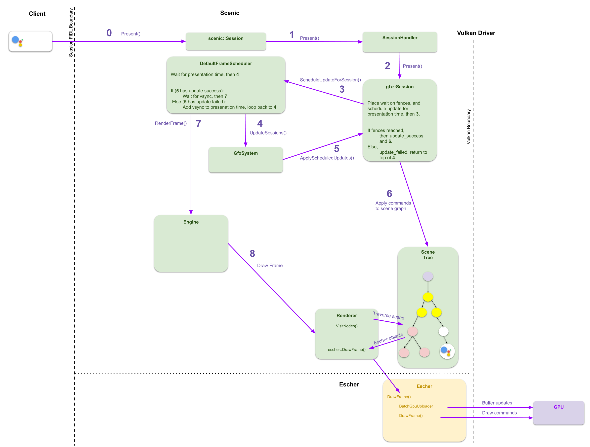

# Life of a Pixel

A client requests a set of commands to be Presented as part of a future Scenic frame. A single Scenic frame
can have multiple client "Presents", where each Present represents a Session's update to the global scene graph. This
doc describes the architecture internal to Scenic for how a request becomes pixels.

The diagram below shows the steps a client Present follows when it is requested. Everything between the Scenic FIDL Boundary and the Vulkan driver is currently single-threaded and executes sequentially.
(Note, there are ongoing refactors to simplify these series of steps. See SCN-1202 for more info).

0. Client Enqueue()s a set of commands to change its content, and calls Present().
1. The Present request is funneled through the scenic::Session ...
2. ... through SessionHandler ...
3. ... to gfx::Session. This places a wait on the Present acquire_fences, and schedules an update for the targeted presentation_time.
4. The FrameScheduler places the request on a task. This waits for the target_presentation time, then calls SessionUpdater::UpdateSessions().
5. The GfxSystem is a SessionUpdater. For each client Session, it calls ApplyScheduledUpdates().
    If the acquire_fences for the Session are reached, the commands are applied to the Scene Graph (step 6).
    Else, if the acquire_fences are not reached, the udpate is considered "failed" and returns to the FrameScheduler. The FrameScheduler then increments the target_present time by a VSYNC interval, and retries the update on the next frame.
6. Commands from a Session are applied to the global scene graph. The scene graph is dirty at this time, and should not be read by other systems (i.e. input).
7. When the SessionUpdaters have successfully updated, the FrameScheduler is notified the scene graph is dirty, and triggers a RenderFrame() on the FrameRenderer.
8. The gfx::Engine is a FrameRenderer. To draw a frame, its renderer traverses the scene graph and creates Escher::objects for each element in the scene. It then passes these obejcts to Escher, and calls DrawFrame(). The Escher interprets these objects as vk::commands, and sends those to the GPU.

